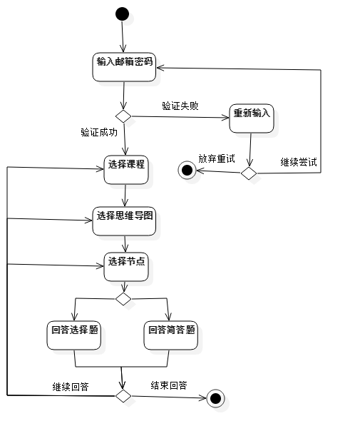
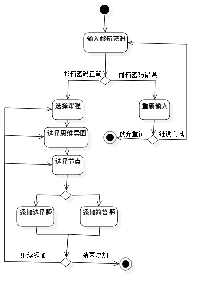
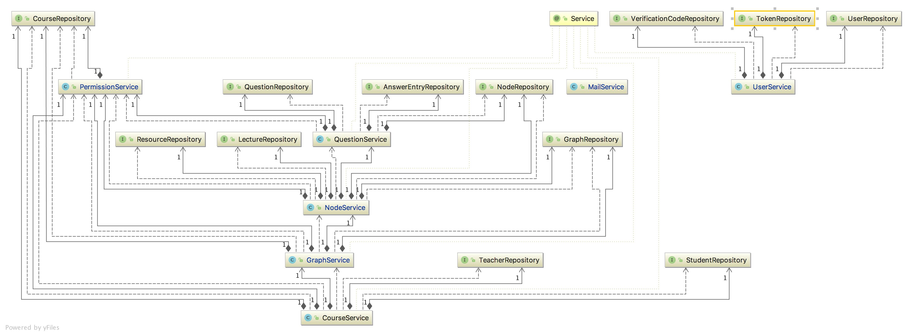
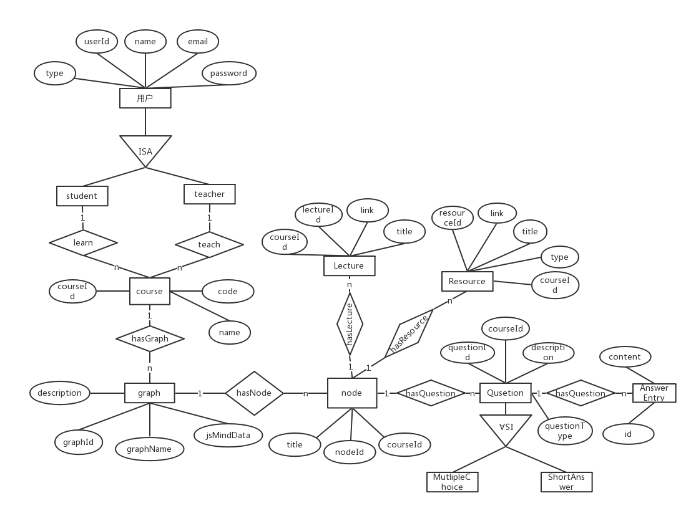

# Course Graph
高级 Web（2018 年春）课程项目。

## 流程分析

下图给出了用户操作网站的一个完整的流程，图中对于区分用户类型的操作，在流程图中会特别标注出用户的类型。具体的流程如下：


## 功能分析

### 总体功能

该系统的用户为学生和老师。系统提供给用户的功能主要是两个方面：个人信息相关功能（注册，登录等），课程相关功能（查看思维导图，课件，作业等）。对于学生和老师，提供的功能会有所区别，但都覆盖这两个方面。具体的功能可以参考下面的用例图：


### 课程导图相关功能

课程导图是系统提供的主要功能之一。下面给出了用户从登录到查看以及编辑思维导图的一个完成流程：


### 文件资源相关功能

用户在选中课程节点后，可以针对该课程节点的文件资源进行一系列操作。学生可以下课文件资源，而教师可以上传文件资源，下图给出了文件资源相关操作的一个完整流程：


### 作业问题相关功能

学生可以回答课程节点的问题，而教师可以添加问题，下面给出一个问题相关的操作流程：





## 总体架构

### 结构图


后端在接收到前端发送的请求后会首先经过 Authorization Interceptor 层，进行权限验证，验证方式是检查 HTTP 请求头部的 `Authorization` 字段的 token 数据，通过验证后，进入到 Current User Resolver 解析层，通过 token 信息获取对应的用户信息。在经历拦截解析后，后端会根据请求的 URL 将请求传给对应的 controller，controller 调用对应 service 层处理请求；service 层通过 spring data 层与后端数据库进行交互，在对数据进行操作时会对当前用户进行权限检查(Permission check)，如学生不能修改课程数据。Service 层在执行过程中如果出现异常，系统会进入 Exception Handler，将异常处理的结果返回给前端。

### 类图

controller 和 service 的类图如下：


service 和 repository 之间的类关系如下：



### 数据库架构

此次项目我们使用了 Neo4j 和 Redis 这两个数据库。其中 Neo4j 是我们的主力数据库用于网站的数据存储和管理，而 Redis 数据库主要是用于用户权限验证服务和邮箱验证码服务，关于两个数据库具体的设计可以参见下文数据库设计部分。这里给出我们在使用 Neo4j 数据库时所设计的 ER 图。



主要的 Entity 有user，course， graph，node，question，lecture，resource。其中 user 分为两种类型，student 和 teacher，question 也分为两种类型 short answer question 和 multiple-choice question。学生和老师和课程的关系分别是 learn 和 teach。一个课程可以和多个 graph 节点相连，即可以有多张思维导图。graph 节点存储了图的基本信息以及思维导图的信息，和一个 graph 相连接的是思维导图里的课程节点 node，每一个课程节点都与其课件（lecture），资源（resource），问题（question）节点相连接。

## 前端开发

前端基于 Angular 4 框架进行开发，使用 Bootstrap 4 框架进行页面样式设计，jQuery 实现动态侧边栏效果。

### 组件结构设计

基本上是一个组件代表一个页面，Header 组件是顶部导航栏，Course 组件包含了四个子组件。

```
-header.component
-login.component
-courselist.component
-course.component (parent)
    --mindmap.component (child)
    --homework.component (child)
    --lecture.component (child)
    --resource.component (child)
-profile.component
-register.component
```

### 页面间交互
#### 路由配置

- 在 Angular 中，页面之间的跳转可以使用传统的做法，但使用路由是一个更灵活的做法。
- 路由配置可以单独写成一个 Module，在使用到的 Module 里引入即可（也需要引入 Router 模块）。
- 路由配置的核心是编写 path 与 component 的映射。配置之后，可以通过 `a` 标签的 `router-link` 属性指定跳转的路径，也可以在 component 里，通过 Router 模块提供的 `navigate`，`redirectTo` 等方法指定跳转目标，为复杂的跳转条件判断提供了方便的支持。
- 可以方便地匹配错误的路径，为其指定跳转页面。

#### 组件间传值

- 在模板中通过 selector 引用组件内容时，可以在标签内填写要传递的字段，相应地，在子组件中通过 @Input 注解接收对应值。这一方式应用在了 course 组件与其四个子组件之间，子组件根据父组件提供的 node id 向后端请求数据。
- 通过 `a` 标签的 `router-link` 在组件间跳转时，可以使用 `queryParams` 属性承载要传递的数据，相应地在接收传值的模块里能够通过 ActivatedRoute 模块提供的 `routerIonfo.snapshot.queryParams` 方法得到数据。这一方式应用在 courselist 组件与 course 组件之间，后者需要前者提供的 course id 向后端请求数据。

### 与后端交互
#### 服务注入

- 能够复用的代码抽取出来封装成 service 是一个较好的选择，能够降低耦合度。比如项目中的 StorageService 用于向浏览器的 `localStorage` 中读写条目，使用时只需要在组件中注入即可（也可以 new 一个实例，但是效率不高，不推荐）。
- 对于数据的获取和处理（与后端交互）也应封装成 service，比如基于 HTTP 模块包装的 `MyHttpService` 在每一个请求头部加入用于身份验证的 token，同时能够方便地更改后端服务的 API 请求地址。此外，将每个页面向后端获取数据的操作内聚成一个 service（如 UserService，CourseService）。

### 关键功能实现

#### 表单实时验证

- 通过双向数据绑定和条件语句结合实现表单的实时验证。
- 在模板中，用[(ngModel)]绑定 component 中的数据，用 `*ngIf` 语句决定满足条件与否时分别要显示的内容。通过这种方式，注册登录的输入框可以做到实时检测到是否表项是否填写，是否满足填写条件，并给出相应的提示内容。

#### 身份验证

- 登录之后，从后端收到唯一的 token，使用 StorageService 将其储存在浏览器的 `localStorage` 里。
- 每次需要向后端发送请求，MyHttpService 会从 `localStorage` 中取出 token 并添加到请求报文的 header 的 `Authorization` 字段里。

#### 弹窗

- 使用 ngx-bootstrap 提供的 Modal 模块可以很容易地实现弹窗效果。
- 具体做法是：将弹窗内容放在 `<ng-template>` 标签内，点击按钮时将 template 的引用传给点击方法，在方法内调用 show 或 hide 方法。

#### 文件上传下载

- 文件上传使用了 `ng2-file-uploader` 模块，该模块对于文件上传实现了拓展操作，例如显示进度条、取消下载操作以及队列操作等，该模块并且显性支持对文件上传各阶段的操作，通过设置各阶段的回调函数，将函数注入到 uploader 的实例中。

  使用方法：首先在 ts 文件内载入 `ng2-file-uploader`，导入 FileUpLoader 类。在 html 文件中提供选择文件、上传文件等选项，并将其与 ts 文件中 uploader 的实例相绑定。Ts 文件中主要涉及 uploader 实例的初始化，包括设置 URL、method、token 等参数。然后设置 uploader 实例的增加文件回调函数、构造单个上传回调函数、上传成功回调函数，在构造单个上传文件的回调函数中，将文件的额外参数如描述等注入 HTTP 请求，在上传成功的回调函数中通知前端变更状态。

- 文件下载使用了 `ngx-filesaver` 模块，该模块包装了文件下载的相关实现细节，将操作接口暴露在 HTML 的属性中方便操作。

  使用方法：在 html 文件中添加下载文件的按钮，在按钮中声明 `filesaver`，并绑定 method、url、header 等参数，设置成功与失败的回调函数。在 ts 文件中只需要实现两种回调函数即可。

## 后端开发
本项目的后端提供了一个面向前端的 REST 服务。在技术栈上，主要使用了 Spring Boot 框架，Neo4j 数据库和 Redis 内存数据库。

### 项目结构说明
后端项目的目录结构及说明如下：
```
course-graph-server
├── pom.xml # Maven 配置文件
└── src
    ├── main
    │   └── java
    │       └── edu
    │           └── fudan
    │               ├── Application.java # Spring 启动类
    │               ├── annotation # 自定义注解
    │               │   ├── Authorization.java # 用来做用户登录验证的注解
    │               │   └── CurrentUser.java # 用来注入当前登录用户的注解
    │               ├── config
    │               │   └── MvcConfig.java # MVC 配置类
    │               ├── domain # 数据库实体
    │               │   ├── AnswerEntry.java # 学生提交的答案
    │               │   ├── Choice.java # 选择题的选项
    │               │   ├── Course.java # 课程
    │               │   ├── Graph.java # 思维导图
    │               │   ├── Lecture.java # 课件
    │               │   ├── Node.java # 思维导图中的节点
    │               │   ├── Question.java # 问题
    │               │   ├── QuestionMultipleChoice.java # 选择题，继承问题
    │               │   ├── QuestionShortAnswer.java # 简答题，继承问题
    │               │   ├── QuestionType.java # 问题类型的枚举类
    │               │   ├── Resource.java # 课程资源
    │               │   ├── ResourceType.java # 课程资源的类型，枚举类
    │               │   ├── Student.java # 学生，继承用户
    │               │   ├── Teacher.java # 老师，继承用户
    │               │   ├── TokenEntry.java # 用户登录状态的记录
    │               │   ├── User.java # 用户类
    │               │   └── UserType.java # 用户类型，枚举类
    │               ├── dto # Data transfer object，数据传输对象的定义
    │               │   ├── request
    │               │   │   ├── AddUrlResourceReq.java # 增加 URL 资源的请求
    │               │   │   ├── AnswerQuestionReq.java # 回答问题的请求
    │               │   │   ├── CreateCourseReq.java # 创建课程的请求
    │               │   │   ├── CreateGraphReq.java # 创建思维导图的请求
    │               │   │   ├── CreateQuestionReq.java # 创建问题的请求
    │               │   │   ├── JoinCourseReq.java # 学生选课的请求
    │               │   │   ├── LoginReq.java # 登录请求
    │               │   │   ├── MailRelatedReq.java # 发送邮件验证码请求
    │               │   │   ├── RegisterReq.java # 用户注册请求
    │               │   │   ├── UpdateCourseMetaReq.java # 更新课程元信息的请求
    │               │   │   ├── UpdateGraphMetaReq.java # 更新思维导图元信息的请求
    │               │   │   ├── UpdateJsmindReq.java # 更新思维导图本身的请求
    │               │   │   └── UpdateUserReq.java # 更新用户信息的请求
    │               │   └── response
    │               │       ├── AuthenticationResp.java # 登录成功返回的验证信息
    │               │       ├── CourseMetaResp.java # 请求课程元信息的返回
    │               │       ├── CoursePublicResp.java # 请求课程公共信息的返回
    │               │       ├── ErrorResp.java # 错误信息的返回
    │               │       ├── GraphMetaResp.java # 思维导图元信息的返回
    │               │       ├── JsmindResp.java # 思维导图本身的返回
    │               │       ├── LectureResp.java # 课件的返回
    │               │       ├── QuestionResp.java # 问题的返回
    │               │       ├── ResourceResp.java # 资源的返回
    │               │       ├── UserPrivateResp.java # 用户私密信息的返回
    │               │       └── UserPublicResp.java # 用户公开信息的返回
    │               ├── exception # 各种异常
    │               │   ├── CourseConflictException.java # 重名课程异常
    │               │   ├── CourseNotFoundException.java # 未找到课程异常
    │               │   ├── DuplicateStudentException.java # 学生请求加入已经加入的课程的异常
    │               │   ├── EmailConflictException.java # 注册重复邮箱的异常
    │               │   ├── EmailOrPasswordException.java # 登录时邮箱不存在或密码错误异常
    │               │   ├── FileResourceNotFoundException.java # 文件资源没找到异常
    │               │   ├── GraphConflictException.java # 思维导图重名异常
    │               │   ├── GraphNotFoundException.java # 思维导图没找到异常
    │               │   ├── IllegalQuestionTypeException.java # 问题类型不合法异常
    │               │   ├── IllegalResourceTypeException.java # 资源类型不合法异常
    │               │   ├── IllegalUserTypeException.java # 用户累成不合法异常
    │               │   ├── InvalidCodeException.java # 课程代码错误异常
    │               │   ├── InvalidJsmindException.java # 思维导图格式异常
    │               │   ├── InvalidVerificationCodeException.java # 验证码不匹配异常
    │               │   ├── LectureIOException.java # 课件文件 IO 异常
    │               │   ├── LectureNotFoundException.java # 课件没找到异常
    │               │   ├── NodeNotFoundException.java # 节点没找到异常
    │               │   ├── PermissionDeniedException.java # 权限异常
    │               │   ├── QuestionNotFoundException.java # 问题没找到异常
    │               │   ├── ResourceIOException.java # 资源文件 IO 异常
    │               │   ├── ResourceNotFoundExeception.java # 资源没找到异常
    │               │   └── UserNotFoundException.java # 用户没找到异常
    │               ├── model # 事务逻辑层
    │               │   ├── CourseService.java # 涉及课程的事务
    │               │   ├── GraphService.java # 涉及思维导图的事务
    │               │   ├── MailService.java # 涉及邮箱验证的事务
    │               │   ├── NodeService.java # 涉及节点的事务
    │               │   ├── PermissionService.java # 权限管理
    │               │   ├── QuestionService.java # 设计问题的事务
    │               │   ├── RandomIdGenerator.java # ID 生成器
    │               │   └── UserService.java # 涉及用户的事务
    │               ├── repository # 数据库访问层
    │               │   ├── AnswerEntryRepository.java # 答案
    │               │   ├── ChoiceRepository.java # 选项
    │               │   ├── CourseRepository.java # 课程
    │               │   ├── GraphRepository.java # 思维导图
    │               │   ├── LectureRepository.java # 课件
    │               │   ├── NodeRepository.java # 节点
    │               │   ├── QuestionMultipleChoiceRepository.java # 选择题
    │               │   ├── QuestionRepository.java # 题目
    │               │   ├── QuestionShortAnswerRepository.java # 简答题
    │               │   ├── ResourceRepository.java # 资源
    │               │   ├── StudentRepository.java # 学生
    │               │   ├── TeacherRepository.java # 老师
    │               │   ├── TokenRepository.java # 登录记录
    │               │   ├── UserRepository.java # 用户
    │               │   ├── VerificationCodeRepository.java # 验证码
    │               │   └── impl
    │               │       ├── RedisTokenRepositoryImpl.java # 登录记录的数据库，使用 Redis 的实现
    │               │       └── RedisVerificationCodeRepositoryImpl.java # 验证码的数据库，使用 Redis 的实现
    │               └── rest # controller 层
    │                   ├── AccountController.java # 涉及账号的路由
    │                   ├── AuthorizationInterceptor.java # 登录验证的 Interceptor
    │                   ├── CourseController.java # 涉及课程的路由
    │                   ├── CurrentUserMethodArgumentResolver.java # 当前登录用户的注入器
    │                   ├── GraphController.java # 涉及思维导图的路由
    │                   ├── LectureController.java # 涉及课件的路由
    │                   ├── NodeController.java # 涉及节点的路由
    │                   ├── QuestionController.java # 涉及问题的路由
    │                   ├── ResourceController.java # 涉及资源的路由
    │                   ├── RestExceptionHandler.java # 异常处理
    │                   ├── TokenController.java # 涉及登录登出的路由
    │                   └── UserController.java # 涉及用户的路由
    └── test # 自动化测试
        ├── java
        │   └── edu
        │       └── fudan
        │           ├── controller
        │           │   └── UserControllerTest.java # 用户控制测试
        │           ├── repository
        │           │   ├── RedisTokenRepositoryTest.java # Redis 测试
        │           │   └── UserRepositoryTest.java # 用户数据库测试
        │           └── service
        │               ├── CourseServiceTest.java # 课程服务测试
        │               ├── GraphServiceTest.java # 思维导图服务测试
        │               ├── NodeServiceTest.java # 节点测试
        │               ├── QuestionServiceTest.java # 问题测试
        │               └── UserServiceTest.java # 用户服务测试
        └── resources
            └── logback-test.xml # Neo4j 测试 log

24 directories, 114 files
```

### 关键功能实现细节
#### 用户登录状态保存
REST 服务器是一个「无状态」的服务器，它不应当与客户端维持会话连接。但有时，我们又需要对客户端发来的请求，做一些访问权限的控制。比如说，只允许登录的用户查看自己的个人信息，不允许其他用户或者未登录用户查看。这时，如果使用传统的会话连接来维护登录状态，就会破坏 REST 服务器「无状态」的要求。而如果要求客户端每次发送请求时，都同时发送账户、密码等信息来做权限验证又未免太低效，而且有安全隐患。

我们的解决办法是，在用户登录时，REST 服务器创建一个 token，并且将 token 与用户 id 的对应关系存储起来，然后将 token 发送给客户端。客户端将 token 存放在本地，并且之后每次发送请求时将 token 放入 HTTP 头部中。服务器通过读取请求的头部 token 字段来验证用户的登录状态。token 有一个有效期，用户超过一段时间没有发送请求，服务器就会销毁这个 token，用户下次请求时，就需要重新登录。

#### 邮件验证

我们的邮件验证是通过 spring-boot-mail 服务和 redis 数据库实现的。spring-boot-mail 提供了发送邮件的功能，开发人员只需要在相关配置文件中配置好邮箱的服务器账户和密码，即可使用对应的方法发送邮件。我们的验证流程大致是这样的：后端在接收到发送验证码请求后，会生成一个 6 位随机数字作为验证码，在进一步处理之前，系统会以用户的注册邮箱为 key，将该验证码的值存入 redis 数据库，并设置过期时间。完成这些操作后，系统调用邮箱服务，将生成的验证码发送给用户。用户将收到的验证码发给后端后，后端会通过用户注册的邮箱在 redis 数据库找到对应的验证码，比较该验证码和用户发送的验证码是否相同，相同则进行下一步操作，不同则返回给用户验证码错误的提示。用户如果在验证码过期之前多次点击发送验证码，后端会将新生成的验证码覆盖掉旧的验证码，再输入旧的验证码时会提示验证码错误。

#### 权限控制
REST 服务器是为前端提供服务的，自然应当依照前端的需求来设计实现。但是，REST 服务接口却是向所有人公开的，可信前端可以调用，不可信的第三方也可以调用。因此，无论在设计 REST 接口，还在实现事务逻辑时，我们都需要考虑到许多可能的安全漏洞。

##### 接口设计的权限控制
在 REST API 的设计上，我们充分考虑了用户的安全隐私。

注意到，用户需要有接口拿到自己的个人信息，同时，也需要提供接口给别的用户。但是，个人信息的私密性要求我们，必须将公开可见的信息与仅自己可见的信息划分开。因此，请求自己的个人信息和请求别人的个人信息拿到的结果应该是不一样的，比如 email 这个字段就不应该暴露给其他用户。

我们不仅在 URL 层面划分开了这两种请求（`/account` 和 `/users/{uid}`），而且在传输的数据格式上也做了相应的区分（`UserPublicResp` 和 `UserPrivateResp`）。

除此之外，课程的传输数据也做了类似的控制：只有选了这门课的学生或者这门课的老师拿到的课程元信息中才包含「课程代码」这样一个字段。这就防止了学生在不知课程代码的情况下恶意获得课程代码信息从而选课。

##### 事务逻辑的权限控制
同时，在事务逻辑层面，我们也做了很多权限的判断。

在项目开发中，我们发现，最主要的权限控制，是在课程内各种资源的访问的修改。比如，一个没有选课的学生不能获得课程的思维导图、不是这门课的老师的用户不能添加作业之类的。我们进一步观察到，所有这些不同层级（课程 --> 图 --> 节点 --> 问题 --> 答案）的权限控制，都可以追溯到课程这一层级：是这个课的学生，就可以获取这门课的所有资源；是这个课的老师，就可以修改这门课的所有内容。基于此，我们借鉴了 UNIX 系统对于权限控制的设计，抽象出了「课程可读」和「课程可读写」两个权限级别：选课学生有可读权限，课程老师有可读写权限。

在实现上，方便同一管理，我们加入了一个 `PermissionService` 服务，专门用来检查请求的权限。敏感的请求，在执行事务逻辑之前，必须经过权限审查。审查不通过的，直接抛出 `PermissionDeniedException`。

#### 表单数据验证
与权限控制的考虑类似，即便前端做了用户输入的判断，我们还是不能假定请求发来的数据格式都是合法的，必须要进一步验证。

我们利用了 `javax.validation.constraints` 包中提供的注解，在 request dto 里相应的字段上标注了对应注解，比如登录请求的邮箱字段需要加上 @Email 注解。这样，就完成了大部分表单数据的验证。对于没有提供的格式类型，比如密码的格式，我们手写了正则表达式来做判断。

### 单元测试
为了使后端代码更加健壮，我们写了大量单元测试，并在每次部署前检查测试的通过情况。

在每个单元测试中，都有详细的注释来解释测试的具体目的，详细请参考 `test/java/edu/fudan/` 目录下的测试文件。

### 数据库连接
#### Neo4j 图数据库
我们使用 Neo4j 图数据库作为主要的数据库。

首先我们需要配置 Spring 连接 Neo4j 的 session factory。在 `Application` 中设置相应的 bean 并配置好 domain 和 repository 的包名即可。

Spring 提供了访问操作 Neo4j 的方便方法。对于一般的 CRUD 操作，我们只需要为 Neo4j 数据库中的每一个节点类型定义一个相应的 Repository，并使其继承 `Neo4jRepository<T, ID>`，其中 `T` 是 domain 中的节点类型，`ID` 是这个节点的主键类型。对于额外的复杂操作，需要写一些 Cypher 语句。

#### Redis 内存数据库
我们使用 Redis 内存数据库作为用户登录认证信息和邮箱验证码的临时存储数据库。

首先我们需要配置 Spring 连接 Redis 的 connection factory。我们在这里使用 Jedis，这是一个轻量级的 Redis 客户端，与 Spring 兼容得很好。

`redisTemplate` 是 Spring 用来操作 Redis 的模版。我们将在 Redis 中存入一些以用户 ID 为键，生成的 token 为值的键值对。用户登录状态的 `redisTemplate` 使用 `Long` 作为键的数据类型，`String` 作为值的数据类型。

最后，我们对两种数据类型分别实现一个 Repository 来完成对其的增删改查和一些辅助操作。

#### Transaction（事务）的使用
由于服务器支持多线程访问，需要考虑多个用户同时修改数据库时避免出现相互干扰和数据不一致的情况。

为了解决这个问题，我们使用了 Spring 的 Transaction manager。在 service 类的头部加上 @Transactional 的注解，Spring 就会自动将其中的每个方法视为一个 transaction。在一个 transaction 中，对于数据库的操作是原子性的。因此，这就解决了多线程访问的数据库一致性问题。

### ID 设计的考虑
后端数据库里的每个资源都需要有一个 ID 作为标识。我们在设计这个 ID 时，也有过一些考虑。

一般来说，ID 的生成可以有两种方式：一是让数据库自动生成，在 Neo4j 中就是将 domain 类中的 ID 字段标为 @Generative；二是服务器手动生成。使用第一种方式在一般情况下都是没有什么大问题的，数据库会确保 ID 的唯一性。但是，在某些情况下，比如当后端服务器必须使用分布式的架构，多个数据库运行在多个机器上时，就会有一定概率出现重复的 ID。虽然在课程 PJ 中，这种问题不会出现，但这样的设计不具有可扩展性，因此我们选择了后一种方式，即自己生成这个 ID。

手动生成 ID 也有很多种选择，可以是 UUID，也可以是自增的整数等等。在选择要用哪一种时，我们主要有以下几点考虑。首先，ID 要有可读性。其次，ID 应当是随机的。可读性的考虑主要是美学上的，类似于 UUID 这种的，在功能上可以满足我们的需求，但是在可读性上就比长整数要差很多。随机性的考虑主要时安全方面的，如果使用自增的 ID，那竞争对手就会很容易得知我们的用户量和数据库大小，甚至可以通过扫描接口进行拖库攻击。

基于以上的考虑，我们选择了使用随机生成的 7 位整数作为 ID，兼具可读性与安全性。

## 前后端对接
前端通过调用后端 REST 服务器提供的 API 来完成相应的事务逻辑和数据库操作。

### REST 接口设计
我们的 REST API 设计原则符合通用的几个原则，包括「一切都是资源」，「所有操作都应当划归为 CRUD 操作」等。

同时，为了前后端对接的顺畅，我们提供了完整、详尽的 API 文档，其中不仅记录了有哪些接口，还详细说明了每个接口可以接受的请求类型、请求数据格式、返回数据格式以及可能的错误信息和原因。

详细的 API 文档请移步 [REST-API-Doc](../REST-API-Doc.md)。

### 跨域访问
此次开发，我们通过三种方式来解决 spring boot 中出现的跨域访问(Cross Origin)的问题：

1. 使用 @CrossOrigin 注解；CrossOrigin 是 spring boot 官方提供的用于解决跨域问题的注解。该注解可以添加到 controller 里的方法上，表示对该方法对应的 URL 映射提供跨域访问，它也可以添加到 controller 头部，表示对该 controller 的所有 URL 提供跨域访问。

2. 配置 Spring config 类；添加注解可以解决基本大部分的跨域访问问题，但是在我们测试的过程中发现，有一些访问，即使添加了 @CrossOrigin 注解，仍会出现跨域访问的问题。在 google 上搜索了很久也没有找到问题的原因。我们只好尝试别的办法。除了添加 CrossOrigin 注解，还可以通过配置 Spring Config 来解决跨域问题。配置的大致过程是创建一个配置类并继承 `WebMvcConfigurer`，重写 `addCorsMapping` 方法，添加你想要直接的 URL，具体的代码可以参考后端代码中的 `MvcConfig` 文件。

3. 在 Response 头部添加允许跨域访问的字段；在使用了前两种方法后，跨域访问的问题基本没有出现，但是在一次测试的时候，我们在一台电脑上同时运行前端和后端，前端通过 `http://localhost:port` 这一 url 访问后端，这个时候又一次的出现了跨域访问的问题，前面的两种方法失效了。为了解决这个问题，我们使用了最为直接也最有效的一种方法，在发送后前端的 response 头部中添加允许跨域访问的字段。我们在拦截器中，对 response 头部添加了允许跨域访问的字段，这样做成功的解决了前两种方法没能解决的跨域访问问题，这一部分的具体实现可以参考后端拦截器相关代码。

## 部署
我们将项目部署到了云服务器上。

### 部署流程
大致的部署流程如下：

首先，需要在服务器上安装配置好 Neo4j 和 Redis 数据库，以及 8 以上的版本的 JDK。

然后，将 GitHub 项目 clone 到服务器上，在 `course-graph-front` 目录下运行
```npm install```
命令安装前端依赖，在 `course-graph-server` 目录下运行
```mvn install```
命令安装后端依赖。

最后，需要在 `course-graph-server/src/main/resources/` 目录下，**创建**一个名为 `application.properties` 的文件并写入如下格式的配置信息：
```
# Server config
server.port=8080 # Spring server port
server.address=0.0.0.0 # Spring server host

spring.servlet.multipart.max-file-size=512MB
spring.servlet.multipart.max-request-size=512MB

# Neo4j config
spring.data.neo4j.uri=http://0.0.0.0:7474 # neo4j host and port
spring.data.neo4j.password=neo4j # neo4j password
spring.data.neo4j.username=neo4j # neo4j user name

# Mail server configuration
spring.mail.host=smtp.qq.com # mail server host
spring.mail.username=something@qq.com # mail server user name
spring.mail.password=some-password # mail server password
spring.mail.default-encoding=UTF-8
mail.smtp.auth=true
mail.smtp.starttls.enable=true
mail.smtp.starttls.required=true

# Server side data storage location config
file.dir.path=/path/to/Resources/Files/ # path to resource file
lecture.dir.path=/path/to/Resources/Lectures/ # path to lecture file
```

这样就完成了安装配置工作，只需分别在前端和后端目录下使用 `ng serve` 和 `mvn spring:run` 命令启动 Angular 和 Spring 即可。

### 邮件服务器的选择
我们在部署到云服务器的过程当中遇到了不少问题，其中最头疼的就是邮件验证服务器的选择问题。

我们首先选择了网易的 163 邮箱。我们注册了一个邮箱账户，并在本地成功测试通过了邮箱验证服务。但是，当部署到云端时，遇到了发送邮件失败的问题。经过仔细排查，我们发现，是网易邮箱将我们发送的验证邮件视为了垃圾邮件并拒绝了发送的请求。

于是我们考虑使用 Gmail。同样注册了一个 Gmail 账户后，我们在本地和云端都测试通过了。但是，由于一些不可言说的原因，Gmail 的服务很不稳定，要么是服务器连接 Gmail 超时，要么是 Gmail 发送到用户邮箱收不到。我们在经历了一个下午的持续失败之后，选择放弃 Gmail。

接着我们考虑使用 QQ 邮箱，因为听说国内做邮箱验证服务的大多会选择 QQ 邮箱。但是在注册阶段，我们就遇到了一个大问题，QQ 邮箱要求必须注册时间满半个月才能开启 POP3/IMAP 邮件服务。

最后，我们不得不使用了组员自己个人的 QQ 邮箱，完成了邮件验证的服务。

## 项目管理、合作
在这个项目中，我们组员四人通力合作、分工有序。我们使用 GitHub 管理代码，并建立了一套完整的代码同步规范，使得组员之间的合作得以顺畅完成。

## 给分比例
- 欧承祖（组长）：27.5%
- 熊中正：27.5%
- 刘林方：22.5%
- 程世磊：22.5%
